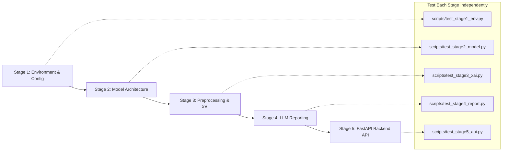

# Rad-Intel Backend Architecture Implementation Plan

Rad-Intel is a clinical decision support system for automated pneumonia detection from chest radiographs (CXRs). The backend fuses deep feature learning (**DenseNet121** local features + **Swin Transformer** global context + **CBAM** dual-attention refinement), visual explainability (**Grad-CAM / Grad-CAM++** and **LIME**), structured radiological report generation (**Gemini 2.5 Flash**), and a high-performance **FastAPI** service.

This plan details a staged backend implementation built on **Python 3.14**. Per your instructions, no frontend will be built yet, and every stage is structured to be independently testable with dedicated verification scripts.

---

## User Review Required

> [!IMPORTANT]
> **Python 3.14 Environment & Pre-Trained Weights**:
> - We verified that official wheels for `torch==2.14.0`, `torchvision==0.29.0`, `grad-cam==1.5.7`, `timm`, `fastapi`, and `google-genai` are available and installable on Python 3.14 on your Windows machine.
> - The model architecture supports:
>   1. Pretrained ImageNet weights (when downloading is permitted).
>   2. Fast initialized/mock weights for local unit testing and development before full training is executed.
>   3. Loading trained weights from `.pt` or `.pth` checkpoints once trained on Colab/Kaggle.

> [!NOTE]
> **Gemini API Key Handling**:
> The reporting module will integrate Google GenAI (`google-genai` SDK) targeting `gemini-2.5-flash`. When `GEMINI_API_KEY` is not present in `.env`, the module provides a deterministic clinical report fallback/mock mode so that end-to-end backend tests pass out-of-the-box without hard-blocking on an API key.

---

## Architectural Stages for Step-by-Step Testing

The backend will be constructed in 5 incremental, independently verifiable stages:



---

## Proposed Changes

### Project Layout

```
c:\digitals\Rad-Intel\
├── .env.example
├── .gitignore
├── pyproject.toml
├── requirements.txt
├── scripts\
│   ├── test_stage1_env.py
│   ├── test_stage2_model.py
│   ├── test_stage3_xai.py
│   ├── test_stage4_report.py
│   └── test_stage5_api.py
├── tests\
│   ├── conftest.py
│   ├── test_models.py
│   ├── test_preprocessing.py
│   ├── test_xai.py
│   ├── test_reporting.py
│   └── test_api.py
└── src\
    └── rad_intel\
        ├── __init__.py
        ├── config.py
        ├── models\
        │   ├── __init__.py
        │   ├── cbam.py
        │   ├── densenet.py
        │   ├── swin.py
        │   ├── hybrid.py
        │   └── factory.py
        ├── preprocessing\
        │   ├── __init__.py
        │   └── transforms.py
        ├── xai\
        │   ├── __init__.py
        │   ├── gradcam.py
        │   ├── lime_explainer.py
        │   └── visualizer.py
        ├── reporting\
        │   ├── __init__.py
        │   ├── prompt_templates.py
        │   ├── gemini_client.py
        │   └── report_generator.py
        ├── storage\
        │   ├── __init__.py
        │   ├── database.py
        │   └── models.py
        └── api\
            ├── __init__.py
            ├── main.py
            ├── schemas.py
            ├── dependencies.py
            └── routes\
                ├── __init__.py
                ├── health.py
                ├── predict.py
                ├── explain.py
                ├── report.py
                └── history.py
```

---

### Stage 1: Environment, Configuration & Core Skeleton

Establish the project virtual environment, configuration settings using `pydantic-settings`, logging infrastructure, and directory setup.

#### [NEW] [pyproject.toml](file:///c:/digitals/Rad-Intel/pyproject.toml)
Defines project metadata, Python 3.14 constraint, package dependencies (`torch`, `torchvision`, `timm`, `fastapi`, `uvicorn`, `pydantic`, `pydantic-settings`, `google-genai`, `opencv-python-headless`, `grad-cam`, `lime`, `pillow`, `scikit-learn`, `pytest`, `httpx`).

#### [NEW] [requirements.txt](file:///c:/digitals/Rad-Intel/requirements.txt)
Presents pinned requirements for straightforward virtual environment replication.

#### [NEW] [.env.example](file:///c:/digitals/Rad-Intel/.env.example)
Template containing `GEMINI_API_KEY`, `DEVICE=cpu|cuda`, `DEFAULT_MODEL=hybrid`, `LOG_LEVEL=INFO`, `UPLOAD_DIR=./uploads`, `DATABASE_URL=sqlite:///./rad_intel.db`.

#### [NEW] [src/rad_intel/config.py](file:///c:/digitals/Rad-Intel/src/rad_intel/config.py)
Pydantic Settings class parsing environment variables, setting default paths, device selection (CPU/CUDA auto-detection), model parameters, and thresholds.

#### [NEW] [scripts/test_stage1_env.py](file:///c:/digitals/Rad-Intel/scripts/test_stage1_env.py)
Verifies Python version is 3.14, validates all dependencies are importable, checks PyTorch and hardware acceleration (CUDA/CPU), checks config loading.

---

### Stage 2: Deep Learning Model Architecture (DenseNet + Swin + CBAM)

Implement the exact architectural components specified in the research paper guide:

#### [NEW] [src/rad_intel/models/cbam.py](file:///c:/digitals/Rad-Intel/src/rad_intel/models/cbam.py)
- **Channel Attention**: Computes shared MLP on both `AdaptiveAvgPool2d` and `AdaptiveMaxPool2d`, summed and activated via Sigmoid:
  $$M_c(F) = \sigma(\text{MLP}(\text{AvgPool}(F)) + \text{MLP}(\text{MaxPool}(F)))$$
- **Spatial Attention**: Concatenates channel-wise average and max pooling, processed by a $7 \times 7$ convolution and Sigmoid:
  $$M_s(F') = \sigma(f^{7\times 7}([\text{AvgPool}(F'); \text{MaxPool}(F')]))$$
- Sequential composition: $F' = M_c(F) \otimes F$, $F'' = M_s(F') \otimes F'$.

#### [NEW] [src/rad_intel/models/densenet.py](file:///c:/digitals/Rad-Intel/src/rad_intel/models/densenet.py)
DenseNet121 local feature extractor extracting intermediate feature maps prior to final pooling (output shape: $B \times 1024 \times 7 \times 7$).

#### [NEW] [src/rad_intel/models/swin.py](file:///c:/digitals/Rad-Intel/src/rad_intel/models/swin.py)
Swin Transformer (`swin_tiny_patch4_window7_224` or torchvision `swin_t`) global context extractor extracting spatial feature representation ($B \times C \times 7 \times 7$).

#### [NEW] [src/rad_intel/models/hybrid.py](file:///c:/digitals/Rad-Intel/src/rad_intel/models/hybrid.py)
The proposed core innovation:
- Projects Swin and DenseNet features into a unified embedding dimension.
- Fuses local and global features via channel concatenation and $1 \times 1$ convolution.
- Passes the fused tensor through the CBAM attention module to emphasize pathological regions.
- Classification head: Adaptive Global Average Pooling + Dropout(0.3) + Linear classifier -> binary logits (Normal vs. Pneumonia) or optional multi-class head.

#### [NEW] [src/rad_intel/models/factory.py](file:///c:/digitals/Rad-Intel/src/rad_intel/models/factory.py)
Model registry and factory supporting:
- Proposed `DenseNet-Swin-CBAM` Hybrid
- DenseNet121 baseline (ablation)
- Swin-T baseline (ablation)
- DenseNet + Swin without CBAM (ablation)
- ResNet50 baseline

#### [NEW] [scripts/test_stage2_model.py](file:///c:/digitals/Rad-Intel/scripts/test_stage2_model.py)
Unit test script performing dummy tensor forward passes ($B=2, C=3, H=224, W=224$), verifying output shape, gradient flow, and parameter count across all models and ablation variants.

---

### Stage 3: Image Preprocessing & Explainability Engine (Grad-CAM & LIME)

Medical image preprocessing and XAI saliency generation.

#### [NEW] [src/rad_intel/preprocessing/transforms.py](file:///c:/digitals/Rad-Intel/src/rad_intel/preprocessing/transforms.py)
- PIL/OpenCV image loader supporting RGB/grayscale DICOM-normalized PNG/JPEG.
- CLAHE (Contrast Limited Adaptive Histogram Equalization) enhancement for CXRs.
- Standard ImageNet or CXR normalization.
- PyTorch tensor conversion and validation.

#### [NEW] [src/rad_intel/xai/gradcam.py](file:///c:/digitals/Rad-Intel/src/rad_intel/xai/gradcam.py)
- Grad-CAM / Grad-CAM++ wrapper targeting the fused attention layer / target conv layer.
- Generates 2D normalized heatmaps ($[0, 1]$ range).
- Extracts anatomical localization metrics: computes quadrant activation (Left Upper/Lower, Right Upper/Lower, Bilateral ratio) to feed into the reporting module.

#### [NEW] [src/rad_intel/xai/lime_explainer.py](file:///c:/digitals/Rad-Intel/src/rad_intel/xai/lime_explainer.py)
- LIME image explainer segmenting the X-ray using Quickshift/SLIC and generating superpixel feature weights.

#### [NEW] [src/rad_intel/xai/visualizer.py](file:///c:/digitals/Rad-Intel/src/rad_intel/xai/visualizer.py)
- Overlays colormapped heatmaps (JET / INFERNO) onto original chest X-rays.
- Exports to base64 data URLs and file artifacts for seamless API transport.

#### [NEW] [scripts/test_stage3_xai.py](file:///c:/digitals/Rad-Intel/scripts/test_stage3_xai.py)
Generates a synthetic CXR image, runs preprocessing, runs the hybrid model, generates Grad-CAM and LIME heatmaps, validates output image generation and quadrant localization metrics.

---

### Stage 4: LLM Clinical Report Generation Engine (Gemini 2.5 Flash)

Converts classification metrics + XAI visual findings into standardized radiological reports.

#### [NEW] [src/rad_intel/reporting/prompt_templates.py](file:///c:/digitals/Rad-Intel/src/rad_intel/reporting/prompt_templates.py)
Structured system and user prompts following the American College of Radiology (ACR) format:
- Clinical Indication
- Technique (PA/AP Chest Radiograph)
- Findings (consolidation, opacities, pleural effusion, focal regions identified by XAI)
- Impression (Diagnostic statement with confidence score)
- Recommendations (Clinical follow-up, antibiotics, CT correlation)
- Hallucination Guardrails: Restricts conclusions strictly to provided classification confidence and Grad-CAM localized anatomical quadrants.

#### [NEW] [src/rad_intel/reporting/gemini_client.py](file:///c:/digitals/Rad-Intel/src/rad_intel/reporting/gemini_client.py)
Integration with Google GenAI SDK (`google.genai.Client`) targeting `gemini-2.5-flash`, with retry handling, timeout configuration, and offline fallback generator when API key is not present.

#### [NEW] [src/rad_intel/reporting/report_generator.py](file:///c:/digitals/Rad-Intel/src/rad_intel/reporting/report_generator.py)
Coordinates prediction output, saliency metrics, and patient metadata into the finalized clinical report document (JSON and Markdown).

#### [NEW] [scripts/test_stage4_report.py](file:///c:/digitals/Rad-Intel/scripts/test_stage4_report.py)
Tests report generation with mocked input and live Gemini API (if key present), asserting report sections and anti-hallucination compliance.

---

### Stage 5: FastAPI Core Service & Integration Endpoints

Production-ready REST API with async processing, SQLite audit logging, and modular routing.

#### [NEW] [src/rad_intel/api/schemas.py](file:///c:/digitals/Rad-Intel/src/rad_intel/api/schemas.py)
Pydantic v2 schemas:
- `PredictionResponse`: predicted class, confidence, probabilities dict, latency ms.
- `ExplanationResponse`: Grad-CAM overlay (base64 / path), anatomical attention summary.
- `ReportResponse`: clinical findings, impression, recommendations, report markdown.
- `ComprehensiveAnalysisResponse`: Combined prediction + explanation + report.
- `HistoryResponse`: paginated query history.

#### [NEW] [src/rad_intel/storage/database.py](file:///c:/digitals/Rad-Intel/src/rad_intel/storage/database.py)
SQLite database with async engine (SQLAlchemy or lightweight aiosqlite) for storing predictions, reports, and execution timestamps for auditability.

#### [NEW] [src/rad_intel/api/routes/](file:///c:/digitals/Rad-Intel/src/rad_intel/api/routes/)
- `health.py`: System status, PyTorch version, active hardware (CUDA/CPU), model availability.
- `predict.py`: Image upload endpoint for raw classification.
- `explain.py`: Image upload endpoint for Grad-CAM / LIME saliency.
- `report.py`: Report generation from prediction & saliency data.
- `analyze.py`: One-stop pipeline endpoint (Upload CXR -> Classify -> Grad-CAM -> Gemini Report).
- `history.py`: Retrieval of past scan analyses.

#### [NEW] [src/rad_intel/api/main.py](file:///c:/digitals/Rad-Intel/src/rad_intel/api/main.py)
FastAPI application entry point with CORS middleware, lifespan events (model preloading), error handling, and OpenAPI documentation.

#### [NEW] [scripts/test_stage5_api.py](file:///c:/digitals/Rad-Intel/scripts/test_stage5_api.py)
Uses `httpx.AsyncClient` to send mock chest X-ray images to `/api/v1/health`, `/api/v1/predict`, `/api/v1/explain`, and `/api/v1/analyze`, validating status codes and response schemas.

---

## Verification Plan

### Automated Test Suite
Each stage can be verified individually by running its test script using `.venv\Scripts\python.exe`:

1. **Stage 1**: `python scripts/test_stage1_env.py`
   - Verifies Python 3.14 runtime, installed packages, settings, and device.
2. **Stage 2**: `python scripts/test_stage2_model.py`
   - Verifies model architectures, tensor forward passes, and parameter counts.
3. **Stage 3**: `python scripts/test_stage3_xai.py`
   - Verifies image preprocessing, Grad-CAM generation, heatmap overlays, and localization extraction.
4. **Stage 4**: `python scripts/test_stage4_report.py`
   - Verifies prompt generation and structured clinical report output.
5. **Stage 5**: `python scripts/test_stage5_api.py`
   - Verifies full FastAPI test client across all API routes.
6. **Full Pytest Suite**: `pytest -v tests/`

### Manual Verification
- Run `uvicorn src.rad_intel.api.main:app --host 127.0.0.1 --port 8000` and test interactive API documentation at `http://127.0.0.1:8000/docs`.
